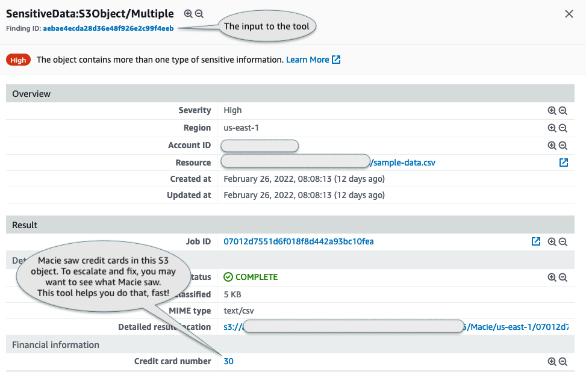

### Macie Finding Data Reveal

This project contains a command line utility to help you analyze Macie findings. Macie generates
sensitive data findings when it discovers sensitive data in S3 objects that you configure a
sensitive data discovery job to analyze. The finding includes [locators] that point to where the
specific sensitive data was observed. The operator can follow these pointers to see what Macie saw
in the object. This follow-up helps the operator (usually a security engineer) decide what to do
next with the specific finding. The CLI in this package automates the manual work involved there.

[locators]: https://docs.aws.amazon.com/macie/latest/user/findings-locate-sd.html

For example, say you're looking at a finding like the following:



Often the next step, i.e. remediation or confirmation of security controls (like encryption,
access-logging, etc.)  depends on determining the accuracy and severity of the findings. Macie shows
the occurrences that are often sufficient to make the decision.


If these /pointers/ are not enough for a particular finding and you need to see the exact data Macie
saw to generate this finding - this is the tool for you.

### Build and Install

This is a Gradle Kotlin project. To build, you need Java 11:

```bash
> git clone https://github.com/aws-samples/amazon-macie-finding-data-reveal
> cd amazon-macie-finding-data-reveal

> ./gradlew build
```

The build produces an executable jar that you can run with Java 11. For convenience you may want to
define an alias:

```bash
> alias reveal="java -jar ${PWD}/reveal/build/libs/reveal-executable.jar"
```

### Usage

The tool makes API calls to Macie and S3 and you'd need to configure [credentials] as you do for use
with AWS ClI.

[credentials]: https://docs.aws.amazon.com/cli/latest/userguide/cli-configure-files.html

```bash
# Locate where your finding and object are
> export AWS_REGION=us-east-1

# Pick the Finding ID from the console and reveal it (all values below are fake)
> reveal 8db5d79296b57dade4abeb2b9a5a8797
┌────────┬────────────────────────────────────────────────────────┐
│ Object │ s3://DOC-EXAMPLE-BUCKET/mock-data/json/50169671.json   │
├────────┼────────────────────────────────────────────────────────┤
│ Mime   │ application/json                                       │
├────────┼────────────────────────────────────────────────────────┤
│ Count  │ 493                                                    │
└────────┴────────────────────────────────────────────────────────┘
┌──────────────┐
│ PHONE_NUMBER │
├──────────────┤
│ 555-0100     │
├──────────────┤
│ 555-0100     │
├──────────────┤
│ 555-0100     │
└──────────────┘
┌────────────────────┐
│ NAME               │
├────────────────────┤
│ Alejandro Rosalez  │
├────────────────────┤
│ Diego Ramirez      │
├────────────────────┤
│ Martha Rivera      │
└────────────────────┘
┌────────────────────────┐
│ ADDRESS                │
├────────────────────────┤
│ 12 Any Street Any Town │
├────────────────────────┤
│ 34 Any Street Any Town │
├────────────────────────┤
│ 11 Any Street Any Town │
└────────────────────────┘
```

### Can I Reveal all findings?

No. Macie scans a wide variety of objects in S3 buckets, ranging from small text files to large
archives that hold hundreds of GBs of data. This tool helps you take a quick peek at the most common
finding types findings to confirm the presence of sensitive data. Currently, the following
mime-types are supported:

- `application/avro`
- `text/csv`
- `application/json`
- `text/plain`
- `application/parquet`
- `application/vnd.openxmlformats-officedocument.spreadsheetml.sheet` (Excel spreadsheets)

Please create an issue if a format you'd like to see isn't on the list. We'll try to add it,
contributions are welcome too!

### Permissions

The tool makes use of public API calls to S3 and Macie, so the usual IAM access control applies. The
caller needs to have the permissions to invoke `macie:GetFindings` on the account and `s3:GetObject`
on the specific object reported in the finding.

### Troubleshooting

#### Mismatched bucket region
Error:
```
ERROR: The bucket you are attempting to access must be addressed using the specified endpoint. Please send all future requests to this endpoint (Service: S3, Status Code: 301)
```
Cause:

The tool uses regional endpoints. Set `AWS_REGION` to match where your Macie session is.

## Security

See [CONTRIBUTING](CONTRIBUTING.md#security-issue-notifications) for more information.

## License

This project is licensed under the MIT-0 License. See the LICENSE file.
